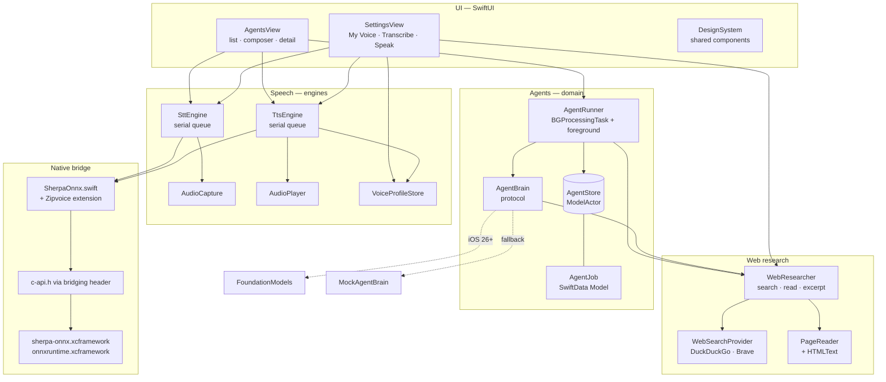

# Agent

An iOS app that runs **AI agents and a complete voice pipeline entirely on the
device**. No account, no model API, no inference in the cloud. The one thing
that leaves the phone is web research — the agent searches and downloads pages
so the on-device model has something current to reason over, and that switch
can be turned off.


Two halves that reinforce each other:

1. **Background agents.** Describe a task ("find the best summer camps for my
   9-year-old near Chicago"), and an agent works on it in the background: it
   plans search queries, reads the pages it finds, then reasons over them with
   Apple Intelligence's on-device model and cites what it used. Come back
   later and press play — the result is read aloud.
2. **On-device speech.** Streaming speech-to-text (used both for dictating
   tasks and for live transcription) and zero-shot voice-cloning
   text-to-speech, which is what gives agent results a voice — optionally
   *your* voice, cloned from a ten-second sample.

The speech half also exists as the local building block for a longer-term
idea: a voice-call app where audio is transcribed on the sender's device, sent
over the network as **text** (~50 bytes/sec instead of 6–24 kbps of Opus), and
re-synthesized on the receiver's device in the sender's cloned voice. The
networking layer isn't built yet; the *Live Transcription* screen's Echo
toggle is a local loopback of that pipeline.

---

## Architecture

Five layers. The UI never touches the native runtime directly, every model
call happens off the main thread, and the model never reaches the network
itself — the web layer does the fetching and hands it text.



### Agent execution

An agent is a row in SwiftData with a status (`queued → running →
completed/failed`), a progress log appended as it works, and a result split
into a spoken-style `resultSummary` and a longer `resultDetail`.

`AgentRunner` is a singleton configured at launch (BGTaskScheduler *requires*
registration before launch finishes). It drains the queue from two entry
points:

| Path | Trigger | Notes |
| --- | --- | --- |
| Foreground | App becomes active, or you spawn an agent | The interactive path, and the only one that works in the simulator |
| Background | `BGProcessingTask` id `com.robsandhu.Agent.agentwork` | iOS schedules it at its discretion (typically idle/charging); the handler re-chains the next slot before starting work |

Interruption is handled explicitly: the task's `expirationHandler` cancels the
work, `drainQueue` catches `CancellationError` and requeues the in-flight job,
and any job left stranded in `running` by a process death is requeued at next
launch (`requeueOrphanedRunningJobs`).

The model behind an agent is swappable via the `AgentBrain` protocol, so the
persistence, scheduling, and playback machinery is independent of which model
runs:

- **`FoundationModelsBrain`** — Apple Intelligence's on-device model, compiled
  in behind `#if canImport(FoundationModels)` and offered only when
  `SystemLanguageModel.default.availability` reports available. Runs three
  passes: plan the search queries, write the findings from what was read, then
  a three-sentence summary written to be read aloud.
- **`MockAgentBrain`** — the fallback where Apple Intelligence isn't
  available. With web research on it still searches and reads for real and
  reports a digest of what it found; with research off it simulates staged
  research, so the whole pipeline is testable on any device.

### Web research

Agents search *before* they think. The model never touches the network itself
— the app runs the searches, decides which pages to download, and hands back
excerpts — so what the model can see is bounded by policy rather than by its
own tool calls.

```
plan queries → search → interleave + dedupe → read N pages → excerpt → ground
```

| Step | Where | Notes |
| --- | --- | --- |
| Plan queries | `FoundationModelsBrain.planQueries` | Guided generation (`@Generable`) forces a list of query strings. Left to free text, a small model answers the task instead of writing queries for it — `WebResearcher.normalize` scrubs the leftovers of that habit (markdown, dash clauses, over-long lines) |
| Search | `WebSearchProvider` | `DuckDuckGoSearch` (keyless) or `BraveSearch` (API key in the keychain) |
| Merge | `WebResearcher` | Round-robins across queries so one query can't monopolize the read budget, and dedupes by canonical host+path |
| Read | `PageReader` + `HTMLText` | Capped at 1.2 MB per page, `<article>`/`<main>` preferred, tags and entities reduced to plain text. A page that won't load degrades to its search snippet rather than failing the job |
| Ground | `FoundationModelsBrain.findings` | Numbered excerpts in the prompt, citations required inline. On a context-window overflow it retries at 1100 → 600 → 300 chars per source, then falls back to unresearched general knowledge |

Sources are persisted on the job (`sourcesJSON`) and listed as tappable links
under the findings, so every claim can be traced back to the page it came
from. Settings › Web Research holds the master switch, the provider choice,
the depth knobs, and a live test button.

### Speech

`AudioCapture` taps `AVAudioEngine` and converts the hardware format
(44.1/48 kHz) to the 16 kHz mono Float32 the models expect. Its output feeds
either the recognizer or the enrollment recorder — never both, since there's
one capture session.

`SttEngine` wraps a streaming Zipformer transducer with endpoint detection: it
publishes a live `partial` and appends a finalized `TranscriptSegment` on each
detected pause. It has a **dictation mode** — when `dictationOnPartial` /
`dictationOnUtterance` are set, recognized speech routes to those callbacks
instead of the main transcript, which is how the composer pill takes spoken
input without polluting the transcription screen.

`TtsEngine` runs ZipVoice zero-shot synthesis on a serial queue. Voice cloning
needs no training: a `VoiceProfile` is just a reference wav plus its
transcript, and synthesis conditions on that pair at call time. Prompt audio
is cached per file path; enrollment writes a new filename each time so the
cache can never go stale.

### Threading

| Component | Executor |
| --- | --- |
| Views, `@Published` state | Main |
| `AudioCapture` callbacks | `AVAudioEngine` render thread |
| `SttEngine` decode loop | Private serial `DispatchQueue` |
| `TtsEngine` synthesis | Private serial `DispatchQueue` |
| `AgentStore` (all SwiftData writes) | `@ModelActor` |
| `AgentRunner.drainQueue` | Swift `Task`, awaits the store actor |

SwiftData contexts aren't thread-safe, so every mutation from a background
task goes through `AgentStore`; the UI reads through `@Query` on its own
main-thread context.

---

## Dependencies

**There are no Swift Package Manager or CocoaPods dependencies.** The one
third-party runtime is vendored as prebuilt `.xcframework` binaries, and the
project file is generated rather than committed.

### Native runtime (vendored, `vendor/`)

| Package | Version | License | Role |
| --- | --- | --- | --- |
| [sherpa-onnx](https://github.com/k2-fsa/sherpa-onnx) | 1.12.21 | Apache 2.0 | Speech runtime — streaming ASR + offline TTS, including ZipVoice zero-shot cloning. Prebuilt iOS xcframework from [`csukuangfj/sherpa-onnx-libs`](https://huggingface.co/csukuangfj/sherpa-onnx-libs) |
| [ONNX Runtime](https://github.com/microsoft/onnxruntime) | 1.17.1 | MIT | Neural network inference (CPU execution provider). Ships inside the sherpa-onnx iOS release |

Pinned to 1.12.21 because that's the newest version with **prebuilt iOS
frameworks published** — 1.13.x has no iOS build. The Swift wrapper, C
headers, and binaries must all come from the same release.

### Models (downloaded, `vendor/models/`)

| Model | Size | License / training data | Role |
| --- | --- | --- | --- |
| [Streaming Zipformer transducer, English 20M](https://github.com/k2-fsa/sherpa-onnx/releases/download/asr-models/sherpa-onnx-streaming-zipformer-en-20M-2023-02-17-mobile.tar.bz2) (int8 encoder + fp32 decoder + int8 joiner) | 34 MB | Apache 2.0 · LibriSpeech | Streaming speech-to-text |
| [ZipVoice-Distill int8, zh-en](https://github.com/k2-fsa/ZipVoice) (`sherpa-onnx-zipvoice-distill-int8-zh-en-emilia`) | 126 MB + 18 MB espeak-ng data | Apache 2.0 · Emilia | Zero-shot voice-cloning TTS (123M-param flow-matching model) |
| [vocos 24 kHz vocoder](https://github.com/k2-fsa/sherpa-onnx/releases/download/vocoder-models/vocos_24khz.onnx) | 52 MB | Apache 2.0 | Mel spectrogram → waveform for ZipVoice |
| Demo reference voice | 212 KB | LibriSpeech sample | Built-in voice so TTS works before you enroll |

229 MB of models in total, which puts the installed app at ~257 MB. `vendor/`
is gitignored and fully reproducible from `scripts/fetch-deps.sh`.

### Apple frameworks

| Framework | Used for |
| --- | --- |
| SwiftUI | Entire UI |
| SwiftData | Agent persistence (`@Model`, `@Query`, `@ModelActor`) |
| BackgroundTasks | `BGProcessingTask` scheduling and execution |
| AVFoundation | Mic capture, format conversion, PCM playback, audio session |
| FoundationModels | Apple Intelligence on-device LLM — **weak, conditional** (`#if canImport`), iOS 26+ |
| URLSession | Web search and page fetching (ephemeral session, no cookie or cache persistence) |
| Security | Keychain storage for the optional Brave API key |
| Combine | `ObservableObject` engines |

### Build tooling

| Tool | Role |
| --- | --- |
| [XcodeGen](https://github.com/yonaskolb/XcodeGen) | Generates `Agent.xcodeproj` from [`project.yml`](project.yml) — the project file is disposable, `project.yml` is the source of truth |

Deployment target iOS 17.0, Swift 5.9, iPhone only. The C API is reached
through an Objective-C bridging header
(`Agent/Support/SherpaOnnx-Bridging-Header.h`) with `-lc++` linked.

---

## Setup

```bash
./scripts/fetch-deps.sh
```

```bash
xcodegen generate && open Agent.xcodeproj
```

The fetch script downloads the frameworks and models (~330 MB of archives)
into `vendor/`, and is idempotent — it skips anything already present.

---

## Source map

```
Agent/
  AgentApp.swift              App entry; builds ModelContainer, registers AgentRunner,
                              warms the TTS model, schedules background work on phase change
  ContentView.swift           Root (AgentsView)
  Agents/
    AgentJob.swift            @Model: status, prompt, timestamps, progress log, result
    AgentStore.swift          @ModelActor: all background SwiftData access
    AgentRunner.swift         BGProcessingTask registration/scheduling + the work loop
    AgentBrain.swift          Brain protocol, MockAgentBrain, FoundationModelsBrain
  Web/
    WebSearch.swift           WebResult/WebSource, provider protocol, WebSearchConfig, keychain
    WebResearcher.swift       Orchestration: queries → search → dedupe → read → excerpts
    DuckDuckGoSearch.swift    Keyless HTML endpoint + Instant Answer fallback
    BraveSearch.swift         Keyed JSON API
    PageReader.swift          Fetch, size-cap, main-content extraction
    HTMLText.swift            HTML → plain text, entity decoding, regex helpers
  Speech/
    AudioCapture.swift        AVAudioEngine tap → 16 kHz mono Float32
    AudioPlayer.swift         Queued Float32 PCM playback
    SttEngine.swift           Streaming recognizer, endpointing, dictation mode
    TtsEngine.swift           ZipVoice synthesis queue, prompt cache, RTF stats
    VoiceProfile.swift        VoiceProfile, VoiceProfileStore, EnrollRecorder
    ModelPaths.swift          Bundle paths for every model file
    SherpaOnnx.swift          Upstream wrapper, verbatim from v1.12.21 swift-api-examples
    SherpaOnnx+Zipvoice.swift The zero-shot generate call upstream doesn't expose
  Views/
    AgentsView.swift          List, composer pill, agent detail, MarkdownText
                              (headings/lists/rules + inline markup)
    SettingsView.swift        Settings hub
    WebSearchView.swift       Web research: switch, provider, depth, test search
    VoiceView.swift           Voice enrollment + selection
    TranscribeView.swift      Live transcription + echo
    SpeakView.swift           Type-to-speak
    DesignSystem.swift        PillButton, Card, SectionLabel, RowGroup, SettingsRow,
                              InfoRow, SelectionRow, StatusDot
  Support/                    Bridging header, generated Info.plist
scripts/fetch-deps.sh         Reproduces vendor/
project.yml                   XcodeGen project definition
```

The design language is flat and monochrome (modeled on Cursor's mobile app):
hairline-separated rows, gray content cards, status dots, and exactly one
high-contrast pill button per screen. Everything routes through
`DesignSystem.swift`, and `PillButton`'s `Color.primary` fill inverts
correctly in dark mode.

---

## Notes and caveats

- **`SherpaOnnx.swift` is vendored upstream code**, copied verbatim from the
  v1.12.21 `swift-api-examples`. Local additions go in
  `SherpaOnnx+Zipvoice.swift` so the wrapper can be replaced wholesale on a
  version bump. The upstream wrapper doesn't expose
  `SherpaOnnxOfflineTtsGenerateWithZipvoice`, which is why that extension
  exists.
- **The simulator can't run `BGProcessingTask`** — `BGTaskScheduler` is
  unavailable there, which the UI surfaces rather than failing silently. To
  test on a real device, pause in the debugger and run:
  `e -l objc -- (void)[[BGTaskScheduler sharedScheduler] _simulateLaunchForTaskWithIdentifier:@"com.robsandhu.Agent.agentwork"]`
- **The DuckDuckGo provider parses HTML, not an API** — there is no free
  keyless search API, so it reads the same no-JavaScript results page a
  browser would get. Markup changes will break it; the parse accepts the
  classes used by both the `html.` and `lite.` front ends, falls back to the
  (supported, but narrow) Instant Answer API, and Brave is there as a
  documented alternative for anyone willing to hold a key.
- **Research is stuffed into the prompt rather than exposed as a tool.**
  FoundationModels can do tool calling, but the on-device model's context
  window is small enough that a search-tool round trip competes with the
  evidence itself for space. Retrieving first and handing over fixed excerpts
  keeps the budget predictable and makes citation numbering deterministic.
- **Web research is the one thing that leaves the device.** The task text goes
  to the search provider and the pages it points at get downloaded; nothing
  else does, and the switch in Settings turns it off entirely — agents then
  fall back to the model's own knowledge.
- **ZipVoice settings**: `numSteps = 4` is the speed/quality sweet spot for the
  distilled model. Measured RTF ≈ 1.0 in the simulator on an M-series Mac —
  roughly real time.
- **The 20M Zipformer emits unpunctuated, uppercase text.**
  `SttEngine.prettify` normalizes casing, and `TtsEngine` appends terminal
  punctuation before synthesis because ZipVoice's prosody depends on it.
- **Enrollment rejects near-silent recordings** (peak amplitude below 0.02) —
  cloning from silence produces an unusable voice, and a muted or covered mic
  is otherwise invisible until playback.
- **Model licenses are separate from the runtime's.** sherpa-onnx and ZipVoice
  are Apache 2.0 and the bundled models are permissive, but check each model
  card before shipping anything commercially.
